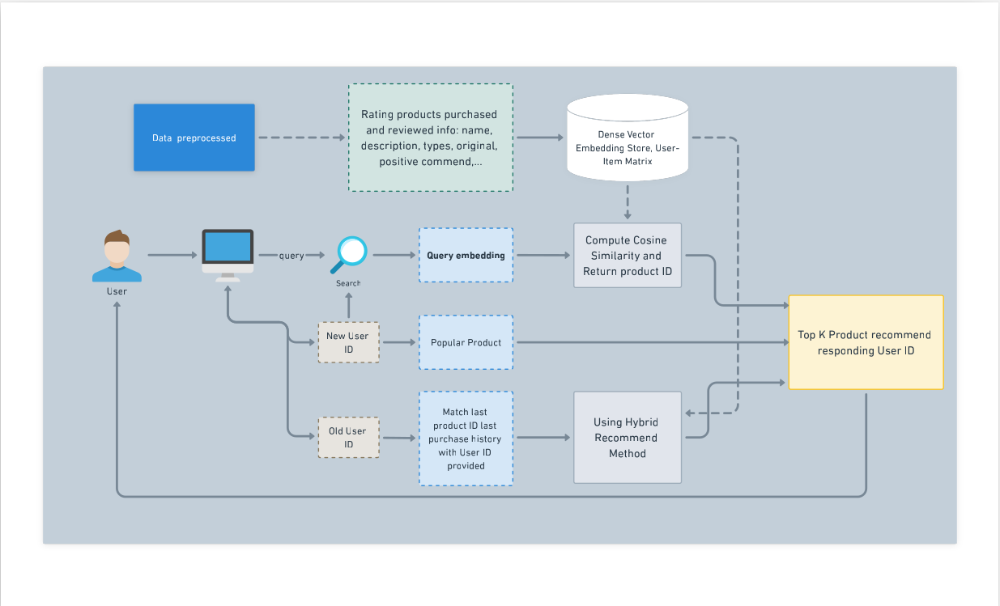
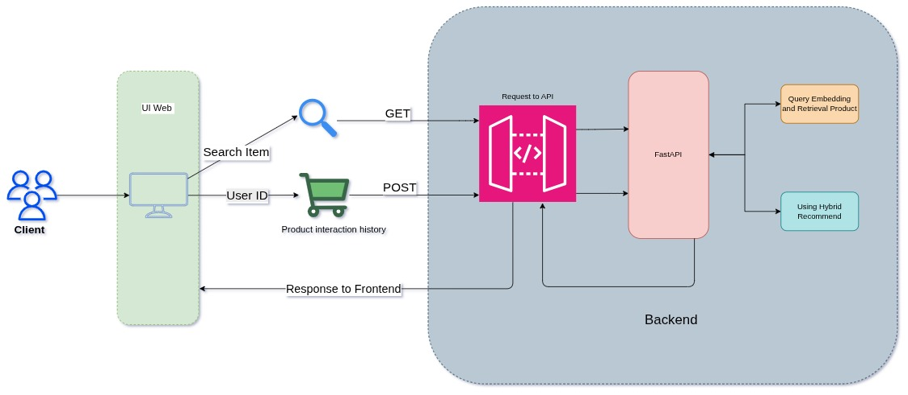
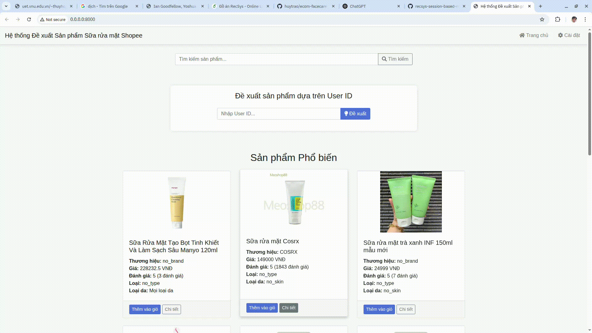

# E-commerce Facecare Recommender

A Content-based recommendation system for facecare products in an e-commerce.

📘 **This project is a course project of the "Recommendation System" class at HCMUS (University of Science, VNU-HCM), implemented by three undergraduate students.**  
It focuses on applying modern embedding techniques and personalization strategies in the context of Vietnamese e-commerce.

This project has outperformed the baseline from the paper [ViEcomRec: A Dataset for Recommendation in Vietnamese E-Commerce](https://doi.org/10.1007/978-981-97-0669-3_7) by using a combination of product information and an embedding-based model with user-based filtering.

It leverages product descriptions, user reviews, and semantic embeddings to provide personalized recommendations for facecare products.

We build a FastAPI application to serve recommendations and provide a user-friendly interface for e-commerce platforms.

### 👥 Team Members

| No. | Name                  | Student ID |
| --- | --------------------- | ---------- |
| 1   | Nguyen Cong Tien Dung | 22280014   |
| 2   | Trao An Huy           | 22280041   |
| 3   | Dinh Xuan Khang       | 22280042   |


### Some technical highlights
    - **FastAPI**: For building the API endpoints and backend logic.
    - **Docker**: For containerization and deployment.
    - **UI**: Using HTML and CSS templates for a simple web interface.

### Pipeline


### System architecture


#### Performance:
| Model                             | Recall\@10 | MRR\@10   | NDCG\@10  |
| --------------------------------- | --------- | --------- | --------- |
| Baseline (CB-Ada2+Popularity)  | 0.1644     | 0.0742    | 0.2721     |
| AIVietnamese Embedding (AITeamVN) | 0.1940     | 0.0885     | 0.3232     |
| **Our Improved Model**          | **0.0296** | **0.0143** | **0.0511** |

# Demo
---


# Embedding models
---
[](https://huggingface.co/AITeamVN/Vietnamese_Embedding)

[](https://huggingface.co/bkai-foundation-models/vietnamese-bi-encoder)

# Project Structure
---
```
ecom-facecare-recommender/
│
├── src/                          # Main source code directory
│   ├── __init__.py
│   ├── main.py                   # Application entry point
│   │
│   ├── core/                     # Core configuration and settings
│   │   ├── __init__.py
│   │   └── config.py            # Application configuration
│   │
│   ├── models/                   # Data models and schemas
│   │   ├── __init__.py
│   │   └── schemas.py           # Pydantic models for API
│   │
│   ├── services/                 # Business logic services
│   │   ├── __init__.py
│   │   ├── data_service.py      # Data loading and management
│   │   └── recommendation_service.py  # Recommendation algorithms
│   │
│   ├── api/                      # API routes and endpoints
│   │   ├── __init__.py
│   │   └── routes.py            # FastAPI routes
│   │
│   └── utils/                    # Utility functions
│       ├── __init__.py
│       ├── logging.py           # Logging configuration
│       └── exceptions.py        # Custom exceptions
│
├── data/                         # Data files (CSV files)
├── embeddings/                   # Pre-computed embeddings
│   ├── vie_bi_encode_embedding.npy
│   └── vietnamese_embedding.npy
│
├── static/                       # Static web assets
├── templates/                    # HTML templates
├── logs/                         # Application logs
├── notebooks/                    # Jupyter notebooks
│
├── app.py                        # Legacy entry point (backward compatible)
├── main.py                       # New entry point
├── requirements.txt              # Python dependencies
├── .env                          # Environment variables
├── Dockerfile                    # Docker configuration
└── README_RESTRUCTURED.md        # This file
```

# Data
---
You can find the datasets in Kaggle, link: [](https://www.kaggle.com/datasets/danielway17/face-clean-ecomer)


# Quick Guide
---
### 1. Clone the repository:
```bash
git clone https://github.com/yourusername/ecom-facecare-recommender.git
cd ecom-facecare-recommender
```

### 2. Create and activate conda env 
```bash
conda create -n face_clean_env python=3.9
conda activate face_clean_env
```

### 3. Environment Setup
```bash
# Install dependencies
pip install -r requirements.txt
```

### 4. Running the Application

```bash
python app.py
```

### 5. API
Once running, visit:
- Application: http://localhost:8000
- API Documentation: http://localhost:8000/docs

# Configuration
---
The application can be configured through environment variables or the `.env` file:

```bash
# Server settings
HOST=0.0.0.0
PORT=8000
ENVIRONMENT=development
LOG_LEVEL=INFO

# Data paths
DATABASE__POPULAR_PRODUCTS_PATH=./data/top_brand_products.csv
DATABASE__COMBINED_PRODUCTS_PATH=./data/data_product_combine.csv
# ...
```

# Deployment
---
### Docker
```bash
# Build image
docker build -t ecom-recommender .

# Run container
docker run -p 8000:8000 ecom-recommender
```